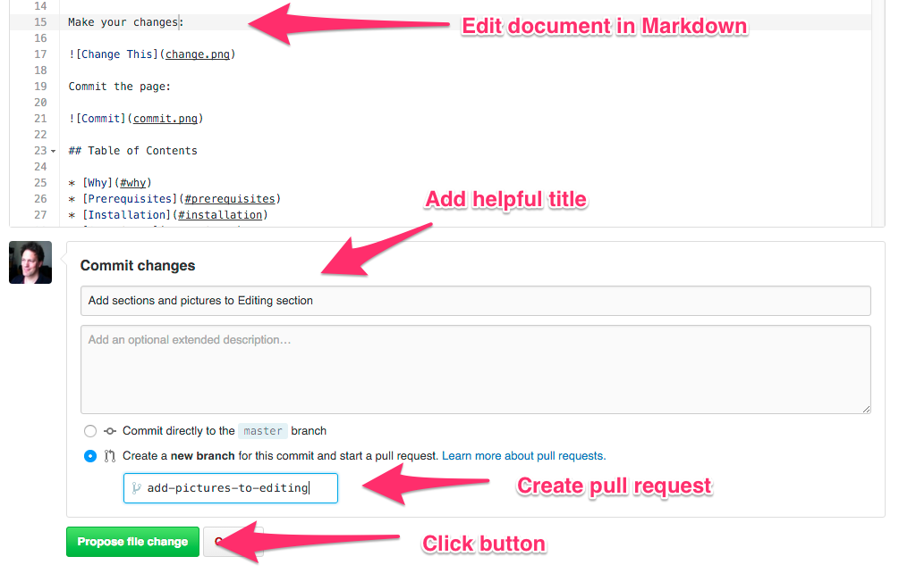

# ImageMagickCheatSheet

# Docker Cheat Sheet

**Want to improve this cheat sheet?  See the [Contributing](#contributing) section!**

## Table of Contents

* [Why ImageMagick](#why-ImageMagick)
* [Prerequisites](#prerequisites)
* [Installation](#installation)
* [Containers](#containers)
* [Images](#images)
* [Networks](#networks)
* [Registry and Repository](#registry--repository)
* [Dockerfile](#dockerfile)
* [Layers](#layers)
* [Links](#links)
* [Volumes](#volumes)
* [Exposing Ports](#exposing-ports)
* [Best Practices](#best-practices)
* [Security](#security)
* [Tips](#tips)
* [Contributing](#contributing)

## Why ImageMagick

"With Docker, developers can build any app in any language using any toolchain. “Dockerized” apps are completely portable and can run anywhere - colleagues’ OS X and Windows laptops, QA servers running Ubuntu in the cloud, and production data center VMs running Red Hat.

Developers can get going quickly by starting with one of the 13,000+ apps available on Docker Hub. Docker manages and tracks changes and dependencies, making it easier for sysadmins to understand how the apps that developers build work. And with Docker Hub, developers can automate their build pipeline and share artifacts with collaborators through public or private repositories.

Docker helps developers build and ship higher-quality applications, faster." -- [What is Docker](https://www.docker.com/what-docker#copy1)

## Prerequisites

I use [Oh My Zsh](https://github.com/robbyrussell/oh-my-zsh) with the [Docker plugin](https://github.com/robbyrussell/oh-my-zsh/wiki/Plugins#docker) for autocompletion of docker commands. YMMV.

### Linux

The 3.10.x kernel is [the minimum requirement](https://docs.docker.com/engine/installation/binaries/#check-kernel-dependencies) for Docker.

### MacOS

 ```
 brew install imagemagick
 ```

## Installation

### Linux


#### CPU Constraints

You can limit CPU, either using a percentage of all CPUs, or by using specific cores.  

#### Memory Constraints

You can also set [memory constraints]


#### Capabilities

Linux capabilities can be set by using `cap-add` and `cap-drop`.


### Info

* [`convert info`](https://docs.docker.com/engine/reference/commandline/ps) shows running containers.


### Executing Commands

* [`docker exec`](https://docs.docker.com/engine/reference/commandline/exec) to execute a command in container.

To enter a running container, attach a new shell process to a running container called foo, use: `docker exec -it foo /bin/bash`.

## Images

Images are just [templates for docker containers](https://docs.docker.com/engine/understanding-docker/#how-does-a-docker-image-work).


## Checking Docker Version 

It is very important that you always know the current version of Docker you are currently running on at any point in time.This is very helpful because you get to know what features are compatible with what you have running. This is also important because you know what containers to run from the docker store when you are trying to get template containers. That said let see how to know what version of docker we have running currently

* ['docker version'](https://docs.docker.com/engine/reference/commandline/version/)   check what version of docker you have running 
* [docker version [OPTIONS]]

Get the server version
$ docker version --format '{{.Server.Version}}'

1.8.0
Dump raw JSON data
$ docker version --format '{{json .}}'


## Contributing

Here's how to contribute to this cheat sheet.

### Open README.md

Click [README.md](https://github.com/wsargent/docker-cheat-sheet/blob/master/README.md) <-- this link


### Edit Page


### Make Changes and Commit




## References

http://www.fmwconcepts.com/imagemagick/fisheye2rect/index.php

