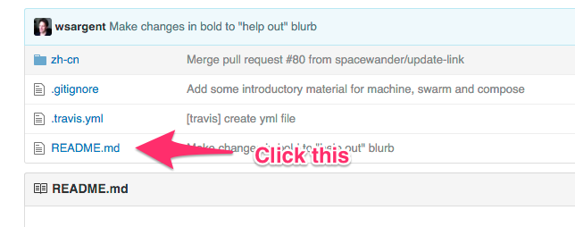
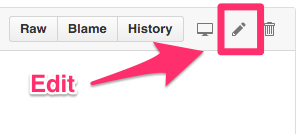
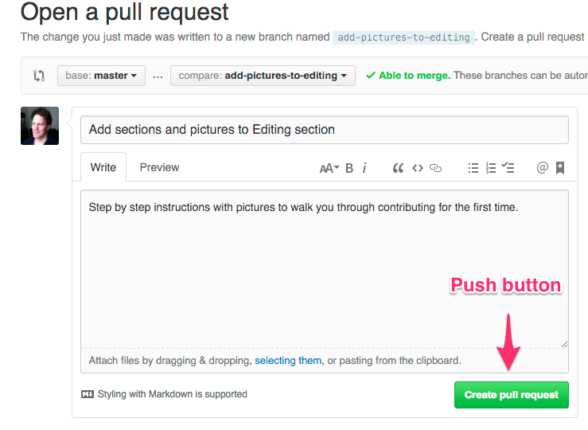

# ImageMagick Cheat Sheet

**Want to improve this cheat sheet?  See the [Contributing](#contributing) section!**

## Table of Contents

* [Why ImageMagick](#why-ImageMagick)
* [Prerequisites](#prerequisites)
* [Installation](#installation)
* [Containers](#containers)
* [Images](#images)
* [Networks](#networks)
* [Registry and Repository](#registry--repository)
* [Dockerfile](#dockerfile)
* [Layers](#layers)
* [Links](#links)
* [Volumes](#volumes)
* [Exposing Ports](#exposing-ports)
* [Best Practices](#best-practices)
* [Security](#security)
* [Tips](#tips)
* [Contributing](#contributing)

## Why ImageMagick

"With Docker, developers can build any app in any language using any toolchain. “Dockerized” apps are completely portable and can run anywhere - colleagues’ OS X and Windows laptops, QA servers running Ubuntu in the cloud, and production data center VMs running Red Hat.

Developers can get going quickly by starting with one of the 13,000+ apps available on Docker Hub. Docker manages and tracks changes and dependencies, making it easier for sysadmins to understand how the apps that developers build work. And with Docker Hub, developers can automate their build pipeline and share artifacts with collaborators through public or private repositories.

Docker helps developers build and ship higher-quality applications, faster." -- [What is Docker](https://www.docker.com/what-docker#copy1)

TL;NR

## Prerequisites

### ColorSpace

### Image Processing

### Image format

TL;NR

## Installation

### Linux

???

### MacOS

 ```
 brew install imagemagick
 ```


### Linux


#### CPU Constraints

You can limit CPU, either using a percentage of all CPUs, or by using specific cores.  

#### Memory Constraints

You can also set [memory constraints]


#### Capabilities

IM capabilities


### Info

* [`convert info`](https://docs.docker.com/engine/reference/commandline/ps) shows running containers.


### Scripts


#### TIFF to PNG:

```
mogrify -background black -format png -depth 8  Data/Training/Images/cancer_subset00/*.tiff
```

####  SVG to PNG:

```
mogrify -background black -format png -depth 8 Data/Training/Labels/cancer_subset00/*.svg
```

#### Resize:

```
mogrify -resize 50% Data/Training/Images/cancer_subset00/*.png
```

#### GrayScale

```
for file in Data/Training/Images/cancer_subset00/*.png; do convert $file  -colorspace Gray $file;done
```

#### SVG fill replace:

```
find ./ -type f -name '*.svg' | xargs -I{} sed -i_old -n -e 's/polygon fill="none"/polygon fill="white"/g;p;' {}
```

#### Gray to RGB

```
mogrify -type TrueColorMatte -define png:color-type=6  /Volumes/UUI/labels/normal/*.png

```
#### Rotate 90

```
mogrify -rotate 90 /Volumes/UUI/images/rotate90/*.png
```
#### Rename with prefix

```
for filename in *.png; do mv "$filename" "prefix_$filename"; done;
```
#### Flip

#### Flop

#### Resize

batch:

```
mogrify -resize 750x750\! *.jpg 
```
#### File Resize

```
mogrify -define jpeg:extent=5100kb *.png
```


## Checking Docker Version 

It is very important that you always know the current version of Docker you are currently running on at any point in time.This is very helpful because you get to know what features are compatible with what you have running. This is also important because you know what containers to run from the docker store when you are trying to get template containers. That said let see how to know what version of docker we have running currently

* ['docker version'](https://docs.docker.com/engine/reference/commandline/version/)   check what version of docker you have running 
* [docker version [OPTIONS]]

Get the server version
$ docker version --format '{{.Server.Version}}'

1.8.0
Dump raw JSON data
$ docker version --format '{{json .}}'


## Contributing

Here's how to contribute to this cheat sheet.

### Open README.md

Click [README.md](https://github.com/wsargent/docker-cheat-sheet/blob/master/README.md) <-- this link



### Edit Page



### Make Changes and Commit





## References

http://www.fmwconcepts.com/imagemagick/fisheye2rect/index.php

